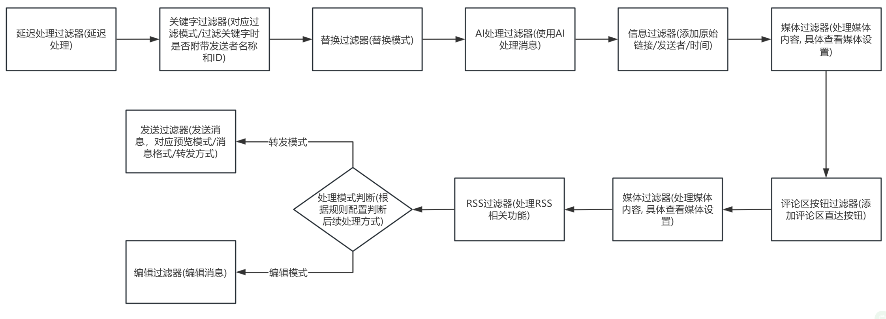
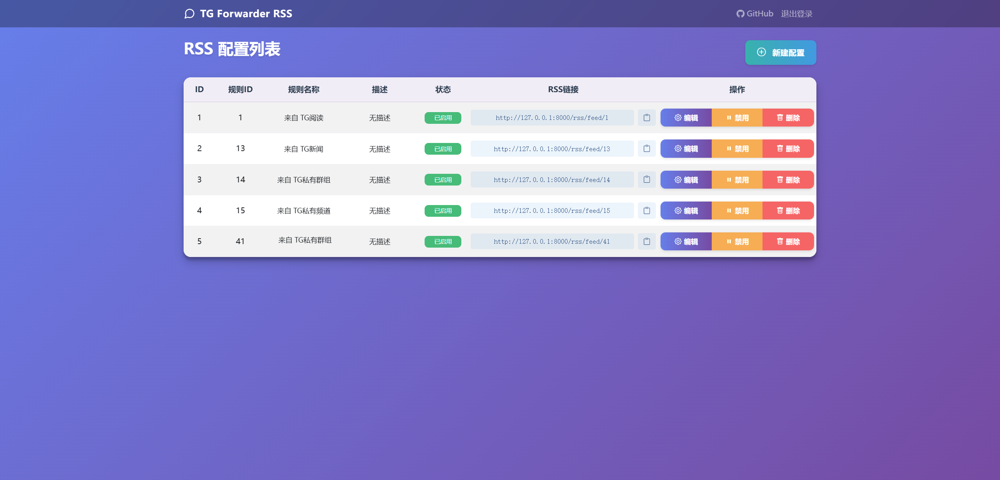

<h3><div align="center">Telegram Forwarder</div>

---

<div align="center">

[][docker-url] [](https://github.com/Heavrnl/TelegramForwarder/blob/main/LICENSE)

[docker-url]: https://hub.docker.com/r/heavrnl/telegramforwarder

</div>

## 📖 Introduction
Telegram Forwarder is a powerful message forwarding tool. As long as your account has joined a channel/group, it can forward messages from specified chats to other chats without requiring the bot to be in the corresponding channel/group for monitoring. It can be used for information stream aggregation and filtering, message notifications, content bookmarking, and many other scenarios, without being restricted by forwarding/copying limitations. Additionally, leveraging the powerful push capabilities of Apprise, you can easily distribute messages to chat apps, email, SMS, Webhooks, APIs, and various other platforms.

## ✨ Features

- 🔄 **Multi-source Forwarding**: Support forwarding from multiple sources to a specified target
- 🔍 **Keyword Filtering**: Support whitelist and blacklist modes
- 📝 **Regex Matching**: Support regular expression matching for target text
- 📋 **Content Modification**: Support multiple ways to modify message content
- 🤖 **AI Processing**: Support AI APIs from various major providers
- 📹 **Media Filtering**: Support filtering specified types of media files
- 📰 **RSS Subscription**: Support RSS subscription
- 📢 **Multi-platform Push**: Support pushing to multiple platforms via Apprise

## 📋 Table of Contents

- [📖 Introduction](#-introduction)
- [✨ Features](#-features)
- [🚀 Quick Start](#-quick-start)
  - [1️⃣ Prerequisites](#1️⃣-prerequisites)
  - [2️⃣ Configure Environment](#2️⃣-configure-environment)
  - [3️⃣ Start Service](#3️⃣-start-service)
  - [4️⃣ Update](#4️⃣-update)
- [📚 User Guide](#-user-guide)
  - [🌟 Basic Usage Example](#-basic-usage-example)
  - [🔧 Special Use Case Examples](#-special-use-case-examples)
- [🛠️ Feature Details](#️-feature-details)
  - [⚡ Filtering Process](#-filtering-process)
  - [⚙️ Settings Description](#️-settings-description)
    - [Main Settings Description](#main-settings-description)
    - [Media Settings Description](#media-settings-description)
  - [🤖 AI Features](#-ai-features)
    - [Configuration](#configuration)
    - [Custom Models](#custom-models)
    - [AI Processing](#ai-processing)
    - [Scheduled Summary](#scheduled-summary)
  - [📢 Push Feature](#-push-feature)
    - [Settings Description](#settings-description)
  - [📰 RSS Subscription](#-rss-subscription)
    - [Enable RSS Feature](#enable-rss-feature)
    - [Access RSS Dashboard](#access-rss-dashboard)
    - [Nginx Configuration](#nginx-configuration)
    - [RSS Configuration Management](#rss-configuration-management)
    - [Special Settings](#special-settings)
    - [Notes](#notes)

- [🎯 Special Features](#-special-features)
  - [🔗 Link Forwarding Feature](#-link-forwarding-feature)
- [📝 Command List](#-command-list)
- [💐 Acknowledgments](#-acknowledgments)
- [☕ Donate](#-donate)
- [📄 License](#-license)


## 🚀 Quick Start

### 1️⃣ Prerequisites

1. Obtain Telegram API credentials:
   - Visit https://my.telegram.org/apps
   - Create an application to get `API_ID` and `API_HASH`

2. Get bot Token:
   - Chat with @BotFather to create a bot
   - Obtain the bot's `BOT_TOKEN`

3. Get user ID:
   - Chat with @userinfobot to get your `USER_ID`

### 2️⃣ Configure Environment

Create a new directory
```bash
mkdir ./TelegramForwarder && cd ./TelegramForwarder
```
Download the repository's [**docker-compose.yml**](https://github.com/Heavrnl/TelegramForwarder/blob/main/docker-compose.yml) to the directory

Then download or copy the repository's **[.env.example](./.env.example)** file, fill in the required fields, and rename it to `.env`
```bash
wget https://raw.githubusercontent.com/Heavrnl/TelegramForwarder/refs/heads/main/.env.example -O .env
```


### 3️⃣ Start Service

First run (requires verification):

```bash
docker-compose run -it telegram-forwarder
```
CTRL+C to exit the container

Modify the docker-compose.yml file, set `stdin_open: false` and `tty: false`

Run in background:
```bash
docker-compose up -d
```

### 4️⃣ Update
Note: Running with docker-compose does not require pulling the repository source code. Unless you plan to build it yourself, you only need to execute the following commands in the project directory to update.
```bash
docker-compose down
```
```bash
docker-compose pull
```
```bash
docker-compose up -d
```
## 📚 User Guide

### 🌟 Basic Usage Example

Suppose you've subscribed to channels "TG News" (https://t.me/tgnews) and "TG Read" (https://t.me/tgread), but want to filter out some uninteresting content:

1. Create a Telegram group/channel (e.g., "My TG Filter")
2. Add the bot to the group/channel and set it as admin
3. Send commands in the **newly created** group/channel:
   ```bash
   /bind https://t.me/tgnews or /bind "TG News"
   /bind https://t.me/tgread or /bind "TG Read"
   ```
4. Set message processing mode:
   ```bash
   /settings
   ```
   Select the rule for the corresponding channel and configure according to your preferences

   For detailed settings, see [🛠️ Feature Details](#️-feature-details)

5. Add blocked keywords:
   ```bash
   /add ad promotion 'this is an ad'
   ```

6. If you find formatting issues with forwarded messages (e.g., extra symbols), you can use regex to handle them:
   ```bash
   /replace \*\*
   ```
   This will remove all `**` symbols from messages

>Note: The above add/remove/modify/query operations only apply to the first bound rule, which is TG News in this example. To operate on TG Read, you need to first use `/settings(/s)`, select TG Read, then click "Apply current rule" to perform add/remove/modify/query operations on it. You can also use `/add_all(/aa)`, `/replace_all(/ra)` and similar commands to apply to both rules simultaneously.

This way, you'll receive filtered and formatted channel messages.

### 🔧 Special Use Case Examples

#### 1. Some messages in TG channels have text embedded with links, clicking them requires confirmation before redirecting, e.g., NodeSeek's official notification channel

Original message format from the channel
```markdown
[**Post Title**](https://www.nodeseek.com/post-xxxx-1)
```
You can use the following commands **sequentially** on the notification channel's forwarding rule:
```plaintext
/replace \*\*
/replace \[(?:\[([^\]]+)\])?([^\]]+)\]\(([^)]+)\) [\1]\2\n(\3)
/replace \[\]\s*
```
All forwarded messages will then become the following format, allowing direct link clicks without confirmation:
```plaintext
Post Title
(https://www.nodeseek.com/post-xxxx-1)
```

---

#### 2. Monitored user messages have unattractive formatting, can optimize message display

Use the following commands **sequentially**:
```plaintext
/r ^(?=.) <blockquote>
/r (?<=.)(?=$) </blockquote>
```
Then set the message format to **HTML**, which will make monitored user messages look much better:


---

#### 3. Sync rule operations

Enable **"Sync rules"** in the **settings menu** and select the **target rule**. All operations on the current rule will be synced to the selected rule.

Applicable scenarios:
- Don't want to manage rules in the current window
- Need to operate on multiple rules simultaneously

If the current rule is only for syncing and doesn't need to take effect, you can set **"Enable rule"** to **"No"**.

---

#### 4. How to forward to Saved Messages
> Not recommended, the process is quite tedious
1. In any group or channel managed by your bot, send the following command:
   ```bash
   /bind https://t.me/tgnews Your Username (i.e., display name)
   ```

2. Create any new rule and configure the following:
   - **Enable sync feature**, sync to the **forward-to-saved-messages rule**
   - **Forwarding mode** select **"User mode"**
   - **Disable rule** (set "Enable rule" to off)

This way, you can manage the saved messages rule from other rules, and all operations will be synced to the **forward-to-saved-messages** rule.


## 🛠️ Feature Details

### ⚡ Filtering Process
First, understand the message filtering order (options in parentheses correspond to settings):




### ⚙️ Settings Description
| Main Settings Interface | AI Settings Interface | Media Settings Interface |
|---------|------|------|
|  |  |  |

#### Main Settings Description
The following describes the settings options
| Setting Option | Description |
|---------|------|
| Apply current rule | After selection, keyword commands (/add, /remove_keyword, /list_keyword, etc.) and replace commands (/replace, /list_replace, etc.) add/remove/modify/query/import/export operations will apply to the current rule |
| Enable rule | After selection, the current rule will be enabled; otherwise it will be disabled |
| Current keyword add mode | Click to switch between blacklist/whitelist mode. Since blacklist and whitelist are processed separately, you need to switch manually. Note: keyword add/remove/modify/query operations are related to this mode. To use commands for add/remove/modify/query on the current rule's whitelist, make sure the mode here is set to whitelist |
| Include sender name and ID when filtering keywords | When enabled, keyword filtering will include sender name and ID information (not added to the actual message), which can be used to filter specific users |
| Processing mode | Switch between edit/forward mode. In edit mode, the original message is modified directly; in forward mode, the processed message is forwarded to the target chat. Note: edit mode only works when you are an admin and the original message is a channel message or a message you sent in a group |
| Filter mode | Switch between blacklist only/whitelist only/blacklist then whitelist/whitelist then blacklist modes. Since blacklist and whitelist are stored separately, choose different filtering methods as needed |
| Forwarding mode | Switch between user/bot mode. In user mode, the user account forwards messages; in bot mode, the bot account sends messages |
| Replace mode | When enabled, messages will be processed according to configured replace rules |
| Message format | Switch between Markdown/HTML format, takes effect at the final sending stage. Generally use the default Markdown |
| Preview mode | Switch between on/off/follow original message. When on, previews the first link in the message. Default follows the original message's preview state |
| Original sender/Original link/Send time | When enabled, this information is added when sending messages. Default off, custom templates can be set in the "Other settings" menu |
| Delayed processing | When enabled, the original message content is re-fetched after the set delay time before starting the processing flow. Suitable for channels/groups that frequently edit messages. Custom delay times can be added in config/delay_time.txt |
| Delete original message | When enabled, the original message is deleted. Please confirm you have deletion permissions before use |
| Comment section shortcut button | When enabled, a comment section shortcut button is added below the forwarded message, provided the original message has a comment section |
| Sync to other rules | When enabled, operations on the current rule are synced to other rules. All settings are synced except "Enable rule" and "Enable sync" |

#### Media Settings Description
| Setting Option | Description |
|---------|------|
| Media type filter | When enabled, non-selected media types will be filtered out |
| Selected media types | Select media types to **block**. Note: Telegram's classification of media files is fixed, mainly these types: photo, document, video, audio, voice. All files that don't belong to photo, video, audio, or voice categories are classified as "document" type. For example, executable files (.exe), archives (.zip), text files (.txt) are all classified as "document" type in Telegram |
| Media size filter | When enabled, media exceeding the set size will be filtered out |
| Media size limit | Set media size limit in MB. Custom sizes can be added in config/media_size.txt |
| Send notification when media exceeds size limit | When enabled, a notification message is sent when media exceeds the limit |
| Media extension filter | When enabled, selected media extensions will be filtered out |
| Media extension filter mode | Switch between blacklist/whitelist mode |
| Selected media extensions | Select media extensions to filter. Custom extensions can be added in config/media_extensions.txt |
| Pass through text | When enabled, filtering media won't block the entire message; text will be forwarded separately |

#### Other Settings Description

The other settings menu integrates several commonly used commands for direct UI interaction, including:
- Copy rule
- Copy keywords
- Copy replace rules
- Clear keywords
- Clear replace rules
- Delete rule

Clear keywords, clear replace rules, and delete rule can also be applied to other rules.

You can also set custom templates here, including: user info template, time template, original link template
| Setting Option | Description |
|---------|------|
| Invert blacklist | When enabled, the blacklist is treated as a whitelist. In whitelist-then-blacklist mode, the blacklist acts as a second-level whitelist |
| Invert whitelist | When enabled, the whitelist is treated as a blacklist. In whitelist-then-blacklist mode, the whitelist acts as a second-level blacklist |

Combined with "X then X" modes, a dual-layer blacklist/whitelist mechanism can be achieved. For example, after inverting the blacklist, the blacklist in "whitelist then blacklist" mode becomes a second-level whitelist, suitable for monitoring specific users and filtering their special keywords, among other scenarios.


### 🤖 AI Features

The project has built-in AI APIs from various major providers that can help you:
- Automatically translate foreign language content
- Scheduled group message summaries
- Intelligently filter advertisements
- Automatically tag content
....

#### Configuration

1. Configure your AI API in the `.env` file:
```ini
# OpenAI API
OPENAI_API_KEY=your_key
OPENAI_API_BASE=  # Optional, defaults to official API

# Claude API
CLAUDE_API_KEY=your_key

# Other supported APIs...
```

#### Custom Models

Can't find the model name you want? Add it in `config/ai_models.json`.

#### AI Processing

The following formats can be used in AI processing prompts:
- `{source_message_context:number}` - Get the latest specified number of messages from the source chat window
- `{target_message_context:number}` - Get the latest specified number of messages from the target chat window
- `{source_message_time:number}` - Get messages from the source chat window within the specified number of minutes
- `{target_message_time:number}` - Get messages from the target chat window within the specified number of minutes

Prompt example:

Prerequisite: After enabling AI processing, perform keyword filtering again. Add "#donotforward" to the filter keywords.
```
This is a news aggregation channel that collects messages from multiple sources. You need to determine whether the new article duplicates existing articles. If it's a duplicate, just reply "#donotforward". Otherwise, return the original text of the new article while preserving the format.
Remember, you can only return "#donotforward" or the original text of the new article.
Here are the historical articles: {target_message_context:10}
Here is the new article:
```

#### Scheduled Summary

After enabling scheduled summary, the bot will automatically summarize messages from the past 24 hours at the specified time (default: 7 AM daily).

- Multiple summary time points can be added in `config/summary_time.txt`
- Set the default timezone in `.env`
- Customize the summary prompt

> Note: The summary feature consumes a significant amount of API quota. Please enable it based on your needs.

### 📢 Push Feature

In addition to internal Telegram message forwarding, the project also integrates Apprise. Leveraging its powerful push capabilities, you can easily distribute messages to chat apps, email, SMS, Webhooks, APIs, and various other platforms.

| Push Settings Main Interface | Push Settings Sub-interface |
|---------|------|
|  |  |

#### Settings Description

| Setting Option | Description |
|---------|------|
| Only forward to push configuration | When enabled, skips the forwarding filter and goes directly to the push filter |
| Media sending method | Supports two modes:<br>- Single: Each media file is pushed as a separate message<br>- All: All media files are combined into one message for pushing<br>Which mode to use depends on whether the target platform supports pushing multiple attachments at once |

### How to add push configuration?
For the complete list of push platforms and configuration formats, refer to [Apprise Wiki](https://github.com/caronc/apprise/wiki)

**Example: Push using ntfy.sh**

*   Suppose you want to push to a topic named `my_topic` on ntfy.sh.
*   According to Apprise Wiki, the format is `ntfy://ntfy.sh/your_topic_name`.
*   The configuration URL you need to add is:
    ```
    ntfy://ntfy.sh/my_topic
    ```


## 📰 RSS Subscription

The project integrates functionality to convert Telegram messages into RSS Feeds, making it easy to convert Telegram channel/group content into standard RSS format for tracking via RSS readers.

### Enable RSS Feature

1. Configure RSS related parameters in the `.env` file:
   ```ini
   # RSS Configuration
   # Whether to enable RSS functionality (true/false)
   RSS_ENABLED=true
   # RSS base access URL, leave empty to use the default access URL (e.g., https://rss.example.com)
   RSS_BASE_URL=
   # RSS media file base URL, leave empty to use the default access URL (e.g., https://media.example.com)
   RSS_MEDIA_BASE_URL=
   ```
2. Uncomment in docker-compose.yml
   ```
    # If you need to use RSS functionality, uncomment the following
     ports:
       - 9804:8000
   ```
3. Restart the service to enable RSS functionality:
   ```bash
   docker-compose restart
   ```
> Note: Users of older versions need to redeploy with the new docker-compose.yml file: [docker-compose.yml](./docker-compose.yml)
### Access RSS Dashboard

Access `http://your_server_address:9804/` in your browser

### Nginx Configuration
```
 location / {
        proxy_pass http://127.0.0.1:9804;
        proxy_http_version 1.1;
        proxy_set_header Upgrade $http_upgrade;
        proxy_set_header Connection "upgrade";
        proxy_set_header Host $host;
        proxy_set_header X-Forwarded-For $proxy_add_x_forwarded_for;
        proxy_set_header X-Forwarded-Proto $scheme;
        proxy_set_header X-Forwarded-Host $host;
    }
```

### RSS Configuration Management

Related interfaces

| Login Interface | Dashboard Interface | Create/Edit Configuration Interface |
|---------|------|------|
|  |  |  |


### Create/Edit Configuration Interface Description
| Setting Option | Description |
|---------|------|
| Rule ID | Select an existing forwarding rule to generate RSS subscription |
| Copy existing configuration | Select an existing RSS configuration and copy its settings to the current form |
| Subscription source title | Set the subscription source title |
| Auto-fill | Click to automatically generate a subscription source title based on the rule's source chat window name |
| Subscription source description | Set the subscription source description |
| Language | Placeholder, no special function currently |
| Maximum entries | Set the maximum number of entries for the RSS subscription source, default 50. For chat sources with lots of media, set according to actual disk size |
| Use AI to extract title and content | When enabled, AI service will automatically analyze messages, extract titles and content, and organize formatting. Set the AI model in the bot; this is not affected by the "Enable AI processing" option in the bot. When this option is enabled, it is mutually exclusive with all configurations below |
| AI extraction prompt | Set the prompt for AI title and content extraction. If customizing, make sure AI returns content in the following JSON format: `{ "title": "title", "content": "body content" }` |
| Auto-extract title | When enabled, titles are automatically extracted using preset regular expressions |
| Auto-extract content | When enabled, content is automatically extracted using preset regular expressions |
| Auto-convert Markdown to HTML | When enabled, Markdown format in Telegram will be automatically converted to standard HTML using relevant libraries. For manual handling, use `/replace` in the bot for custom replacements |
| Enable custom title extraction regex | When enabled, custom regular expressions will be used to extract titles |
| Enable custom content extraction regex | When enabled, custom regular expressions will be used to extract content |
| Priority | Set the execution order of regular expressions; lower numbers mean higher priority. The system executes regex from highest to lowest priority, where **the result of the previous regex becomes the input for the next one**, until all extractions are complete |
| Regex test | Can be used to test whether the current regular expression matches the target text |

### Special Notes
- If only auto-extract title is enabled without auto-extract content, the content will be the complete Telegram message including the extracted title
- If content processing options and regex configurations are both empty, the first 20 characters are automatically matched as the title, and the content is the original message


### Special Settings
If `RSS_ENABLED=true` is set in .env, a new "Only forward to RSS" option will appear in the bot's settings. When enabled, messages will be interrupted at the RSS filter after going through various processing, and will not execute forwarding/editing


### Notes

- There is no password recovery feature; please keep your credentials safe

## 🎯 Special Features

### 🔗 Link Forwarding Feature

Send a message link to the bot, and it will forward that message to the current chat window, bypassing restrictions on forwarding and copying (the project's own functionality already bypasses forwarding and copying restrictions).

### 🔄 Integration with Universal Forum Blocker Plugin
> https://github.com/heavrnl/universalforumblock

Make sure the relevant parameters are configured in the .env file. In a chat window that has already been bound, use `/ufb_bind <forum_domain>` to achieve three-way synchronized blocking. Use `/ufb_item_change` to switch between syncing the current domain's homepage keywords/homepage usernames/content page keywords/content page usernames.

## 📝 Command List

```bash
Command List

Basic Commands
/start - Get started
/help(/h) - Show this help information

Binding and Settings
/bind(/b) <source chat link or name> [target chat link or name] - Bind source chat
/settings(/s) [rule ID] - Manage forwarding rules
/changelog(/cl) - View changelog

Forwarding Rule Management
/copy_rule(/cr) <source rule ID> [target rule ID] - Copy all settings from specified rule to current rule or target rule ID
/delete_rule(/dr) <rule ID> [rule ID] [rule ID] ... - Delete specified rules
/list_rule(/lr) - List all forwarding rules

Keyword Management
/add(/a) <keyword> [keyword] ["key word"] ['key word'] ... - Add plain keywords
/add_regex(/ar) <regex> [regex] [regex] ... - Add regular expressions
/add_all(/aa) <keyword> [keyword] [keyword] ... - Add plain keywords to all rules bound to current channel
/add_regex_all(/ara) <regex> [regex] [regex] ... - Add regex keywords to all rules
/list_keyword(/lk) - List all keywords
/remove_keyword(/rk) <keyword> ["key word"] ['key word'] ... - Remove keywords
/remove_keyword_by_id(/rkbi) <ID> [ID] [ID] ... - Remove keywords by ID
/remove_all_keyword(/rak) <keyword> ["key word"] ['key word'] ... - Remove specified keyword from all rules bound to current channel
/clear_all_keywords(/cak) - Clear all keywords of current rule
/clear_all_keywords_regex(/cakr) - Clear all regex keywords of current rule
/copy_keywords(/ck) <rule ID> - Copy keywords from specified rule to current rule
/copy_keywords_regex(/ckr) <rule ID> - Copy regex keywords from specified rule to current rule
/copy_replace(/crp) <rule ID> - Copy replace rules from specified rule to current rule
/copy_rule(/cr) <rule ID> - Copy all settings from specified rule to current rule (including keywords, regex, replace rules, media settings, etc.)

Replace Rule Management
/replace(/r) <regex> [replacement] - Add replace rule
/replace_all(/ra) <regex> [replacement] - Add replace rule to all rules
/list_replace(/lrp) - List all replace rules
/remove_replace(/rr) <index> - Remove replace rule
/clear_all_replace(/car) - Clear all replace rules of current rule
/copy_replace(/crp) <rule ID> - Copy replace rules from specified rule to current rule

Import/Export
/export_keyword(/ek) - Export keywords of current rule
/export_replace(/er) - Export replace rules of current rule
/import_keyword(/ik) <attach file> - Import plain keywords
/import_regex_keyword(/irk) <attach file> - Import regex keywords
/import_replace(/ir) <attach file> - Import replace rules

RSS Related
/delete_rss_user(/dru) [username] - Delete RSS user

UFB Related
/ufb_bind(/ub) <domain> - Bind UFB domain
/ufb_unbind(/uu) - Unbind UFB domain
/ufb_item_change(/uic) - Switch UFB sync configuration type

Tips
• Content in parentheses is the shorthand form of the command
• Angle brackets <> indicate required parameters
• Square brackets [] indicate optional parameters
• Import commands require attaching a file
```

## 💐 Acknowledgments

- [Apprise](https://github.com/caronc/apprise)
- [Telethon](https://github.com/LonamiWebs/Telethon)

## ☕ Donate

If you find this project helpful, feel free to buy me a coffee through the following:

[](https://ko-fi.com/0heavrnl)


## 📄 License

This project is licensed under the [GPL-3.0](LICENSE) license. For details, please refer to the [LICENSE](LICENSE) file.


